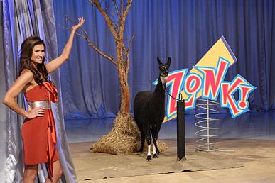
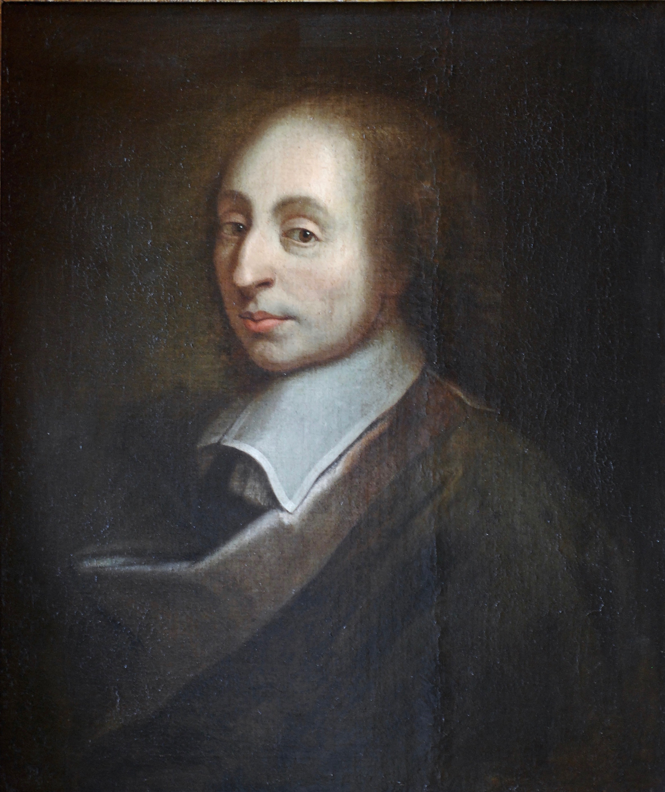

# Aksjomatyka rachunku prawdopodobieństwa

Zanim przejdziemy do badania zjawisk losowych wprowadzimy 
podstawowy język teorii prawdopodobieństwa. Zaczniemy jednak od przykładu
obrazującego potrzebę jego wprowadzenia.

## Problem Monty’ego Halla

W latach sześćdziesiątych w stanach zjednoczonych zaczęto 
nadawać *Let's Make a Deal*.
W teleturnieju wybrani widzowie ze studia zawierają umowy z prowadzącym. 
Uczestnik otrzymuje nagrodę i decyduje, czy ją zatrzymać, czy wymienić na inną, 
której zawartość pozostaje ukryta do momentu podjęcia decyzji. 



Dopiero po odsłonięciu nagrody okazuje się, czy wymiana była korzystna, czy też uczestnik trafił na bezwartościową, 
żartobliwą nagrodę zwaną „zonkiem”.



Rozważmy następujący problem. To dla ciebie decydujący moment. Prowadzący teleturniej stawia cię przed trojgiem zamkniętych drzwi. 
Za jednymi z nich kryje się samochód twoich marzeń — nowy, lśniący. Za każdymi z pozostałych dwojga drzwi stoi natomiast 
sympatyczna, choć niezbyt lśniąca i nieco cuchnąca koza.

Masz wybrać drzwi i wygrać to, co się za nimi znajduje. Wskazujesz jedne z nich i ogłaszasz swój wybór. 
Wtedy prowadzący otwiera jedne z pozostałych dwojga drzwi i pokazuje kozę. 
Następnie pyta, czy chcesz zmienić wybór i wskazać nieotwarte drzwi, których początkowo nie wybrałeś.

Czy zmiana decyzji jest dla ciebie korzystna — zakładając oczywiście, że zależy ci na samochodzie, a nie na kozie?


Jakie jest dokładnie prawdopodobieństwo wygrania samochodu przy każdej z tych strategii? 
Ta popularna zagadka wywołała spore zamieszanie, gdy w 1991 roku ukazała się w prasie @john1991behind. 
Wielu czytelników, w tym także matematycy, podało błędną odpowiedź. 
Najczęściej twierdzono, że zmiana drzwi nie ma znaczenia, ponieważ samochód z jednakowym prawdopodobieństwem 
znajduje się za każdymi z dwojga nieotwartych drzwi.

Jednym ze sposobów zapoznania się z tym problemem jest wielokrotne powtórzenie eskperymantu.
Sam Monty Hall przeprowadził eksperyment w swoim domu w Beverly Hills. W swojej jadalni ustawił na stole trzy miniaturowe kartonowe drzwi. 
Samochód zastąpił kluczykiem do stacyjki a Kozy symbolizowały paczka rodzynek i rolka cukierków. Po przeprowadzeniu trzydziestu prób
odpowiedź była jasne.
Możnmy wykonać podobny eksperymant wykorzystując  symulację poniżej.

```{ojs}
//| echo: false

monty_hall = {
  const root = html`<div class="monty-root">
    <style>
      .monty-root {
        width: 100%;
        max-width: 760px;
        margin: 0 auto;
      }

      .monty-controls,
      .monty-decision {
        display: flex;
        justify-content: center;
        gap: 0.5rem;
        flex-wrap: wrap;
        margin: 0.75rem 0;
      }

      .monty-root button {
        padding: 0.45rem 0.8rem;
        border: 1px solid #98a2b3;
        border-radius: 0.4rem;
        background: var(--bs-body-bg, white);
        color: var(--bs-body-color, #222);
        cursor: pointer;
      }

      .monty-root button.primary {
        color: white;
        background: #2563eb;
        border-color: #2563eb;
      }

      .monty-instruction {
        min-height: 1.6em;
        margin: 0.8rem 0;
        text-align: center;
      }

      .monty-doors {
        display: grid;
        grid-template-columns: repeat(3, minmax(0, 1fr));
        gap: clamp(0.5rem, 3vw, 1.5rem);
        max-width: 660px;
        margin: 0 auto;
      }

      .monty-door {
        position: relative;
        aspect-ratio: 3 / 4;
        overflow: hidden;
        border: 3px solid #98a2b3 !important;
        border-radius: 0.5rem 0.5rem 0 0 !important;
        background: #dbeafe !important;
        color: #1e293b !important;
        transition:
          transform 0.2s ease,
          border-color 0.2s ease,
          background 0.2s ease;
      }

      .monty-door:hover:not(:disabled) {
        transform: translateY(-4px);
      }

      .monty-door.is-chosen {
        border-color: #2563eb !important;
        background: #bfdbfe !important;
      }

      .monty-door.is-open {
        border-color: #94a3b8 !important;
        background: #e2e8f0 !important;
      }

      .monty-door.is-winner {
        border-color: #16a34a !important;
        background: #bbf7d0 !important;
      }

      .monty-number {
        position: absolute;
        top: 8%;
        left: 50%;
        transform: translateX(-50%);
        font-size: clamp(1.25rem, 4vw, 2rem);
        font-weight: bold;
      }

      .monty-content {
        position: absolute;
        inset: 28% 8% 8%;
        display: grid;
        place-items: center;
        font-size: clamp(2rem, 8vw, 4.5rem);
      }

      .monty-stats {
        max-width: 660px;
        margin: 1.4rem auto 0;
      }

      .monty-row {
        display: grid;
        grid-template-columns: 5rem 1fr 9rem;
        align-items: center;
        gap: 0.75rem;
        margin: 0.7rem 0;
      }

      .monty-track {
        height: 1rem;
        overflow: hidden;
        border-radius: 999px;
        background: #e2e8f0;
      }

      .monty-bar {
        width: 0;
        height: 100%;
        border-radius: 999px;
        transition: width 0.35s ease;
      }

      .monty-stay-bar {
        background: #f59e0b;
      }

      .monty-switch-bar {
        background: #2563eb;
      }

      .monty-result {
        text-align: right;
        font-variant-numeric: tabular-nums;
      }

      .monty-total {
        margin-top: 0.75rem;
        color: #667085;
        text-align: center;
      }

      [hidden] {
        display: none !important;
      }

      @media (max-width: 480px) {
        .monty-row {
          grid-template-columns: 4.5rem 1fr;
        }

        .monty-result {
          grid-column: 2;
        }
      }
    </style>

    <div class="monty-controls">
      <button data-new>Nowa rozgrywka</button>
      <button class="primary" data-many="10">
        Symuluj 10 prób
      </button>
      <button class="primary" data-many="100">
        Symuluj 100 prób
      </button>
      <button data-reset>
        Wyzeruj statystyki
      </button>
    </div>

    <p class="monty-instruction" data-instruction>
      Wybierz jedne drzwi.
    </p>

    <div
      class="monty-doors"
      role="group"
      aria-label="Wybierz jedne z trzech drzwi"
    >
      <button
        class="monty-door"
        data-door="0"
        aria-label="Drzwi 1"
      >
        <span class="monty-number">1</span>
        <span class="monty-content"></span>
      </button>

      <button
        class="monty-door"
        data-door="1"
        aria-label="Drzwi 2"
      >
        <span class="monty-number">2</span>
        <span class="monty-content"></span>
      </button>

      <button
        class="monty-door"
        data-door="2"
        aria-label="Drzwi 3"
      >
        <span class="monty-number">3</span>
        <span class="monty-content"></span>
      </button>
    </div>

    <div class="monty-decision" data-decision hidden>
      <button data-stay>
        Zostań przy wyborze
      </button>

      <button class="primary" data-switch>
        Zmień drzwi
      </button>
    </div>

    <div class="monty-stats">
      <div class="monty-row">
        <span>Zostań</span>

        <div class="monty-track">
          <div
            class="monty-bar monty-stay-bar"
            data-stay-bar
          ></div>
        </div>

        <strong
          class="monty-result"
          data-stay-result
        >—</strong>
      </div>

      <div class="monty-row">
        <span>Zmień</span>

        <div class="monty-track">
          <div
            class="monty-bar monty-switch-bar"
            data-switch-bar
          ></div>
        </div>

        <strong
          class="monty-result"
          data-switch-result
        >—</strong>
      </div>

      <p class="monty-total" data-total>
        Brak rozegranych prób
      </p>
    </div>
  </div>`;

  const doors = [
    ...root.querySelectorAll("[data-door]")
  ];

  const instruction =
    root.querySelector("[data-instruction]");

  const decision =
    root.querySelector("[data-decision]");

  let prize;
  let chosen;
  let opened;
  let stage;

  let stayTrials = 0;
  let stayWins = 0;

  let switchTrials = 0;
  let switchWins = 0;

  function randomInt(n) {
    return Math.floor(Math.random() * n);
  }

  function startRound() {
    prize = randomInt(3);
    chosen = null;
    opened = null;
    stage = "choose";

    instruction.textContent =
      "Wybierz jedne drzwi.";

    decision.hidden = true;

    doors.forEach(door => {
      door.disabled = false;
      door.className = "monty-door";

      door.querySelector(
        ".monty-content"
      ).textContent = "";
    });
  }

  function chooseDoor(index) {
    if (stage !== "choose") {
      return;
    }

    chosen = index;

    doors[chosen].classList.add(
      "is-chosen"
    );

    doors.forEach(door => {
      door.disabled = true;
    });

    // Prowadzący może otworzyć tylko drzwi,
    // których gracz nie wybrał i za którymi
    // nie znajduje się samochód.
    const possibleDoors = [0, 1, 2].filter(
      index =>
        index !== chosen &&
        index !== prize
    );

    opened =
      possibleDoors[
        randomInt(possibleDoors.length)
      ];

    doors[opened].classList.add(
      "is-open"
    );

    doors[opened].querySelector(
      ".monty-content"
    ).textContent = "🐐";

    instruction.textContent =
      `Prowadzący otworzył drzwi ${opened + 1} ` +
      "i pokazał kozę. Zostajesz czy zmieniasz?";

    decision.hidden = false;
    stage = "decide";
  }

  function finishRound(strategy) {
    if (stage !== "decide") {
      return;
    }

    let finalChoice;

    if (strategy === "stay") {
      finalChoice = chosen;
    } else {
      finalChoice = [0, 1, 2].find(
        index =>
          index !== chosen &&
          index !== opened
      );
    }

    const win = finalChoice === prize;

    doors.forEach((door, index) => {
      const content =
        door.querySelector(".monty-content");

      content.textContent =
        index === prize ? "🚗" : "🐐";

      if (index === prize) {
        door.classList.add("is-winner");
      }
    });

    doors[finalChoice].classList.add(
      "is-chosen"
    );

    instruction.textContent = win
      ? "Wygrana — samochód!"
      : "Przegrana — samochód był za innymi drzwiami.";

    decision.hidden = true;
    stage = "finished";

    // Ręczna próba jest doliczana do strategii,
    // którą wybrał użytkownik.
    if (strategy === "stay") {
      stayTrials += 1;

      if (win) {
        stayWins += 1;
      }
    } else {
      switchTrials += 1;

      if (win) {
        switchWins += 1;
      }
    }

    updateStatistics();
  }

  function simulateMany(numberOfTrials) {
    for (
      let trial = 0;
      trial < numberOfTrials;
      trial += 1
    ) {
      const simulatedPrize = randomInt(3);
      const simulatedChoice = randomInt(3);

      stayTrials += 1;
      switchTrials += 1;

      // Pozostanie wygrywa dokładnie wtedy,
      // gdy pierwszy wybór był poprawny.
      if (
        simulatedChoice === simulatedPrize
      ) {
        stayWins += 1;
      } else {
        // Jeśli pierwszy wybór był błędny,
        // zmiana zawsze prowadzi do samochodu.
        switchWins += 1;
      }
    }

    updateStatistics();
  }

  function updateStatistics() {
    const stayRate = stayTrials
      ? 100 * stayWins / stayTrials
      : 0;

    const switchRate = switchTrials
      ? 100 * switchWins / switchTrials
      : 0;

    root.querySelector(
      "[data-stay-bar]"
    ).style.width = `${stayRate}%`;

    root.querySelector(
      "[data-switch-bar]"
    ).style.width = `${switchRate}%`;

    root.querySelector(
      "[data-stay-result]"
    ).textContent = stayTrials
      ? `${stayRate.toFixed(1)}% ` +
        `(${stayWins}/${stayTrials})`
      : "—";

    root.querySelector(
      "[data-switch-result]"
    ).textContent = switchTrials
      ? `${switchRate.toFixed(1)}% ` +
        `(${switchWins}/${switchTrials})`
      : "—";

    const totalDecisions =
      stayTrials + switchTrials;

    root.querySelector(
      "[data-total]"
    ).textContent = totalDecisions
      ? `Łączna liczba decyzji: ${totalDecisions}`
      : "Brak rozegranych prób";
  }

  doors.forEach(door => {
    door.onclick = () => {
      chooseDoor(
        Number(door.dataset.door)
      );
    };
  });

  root.querySelector(
    "[data-stay]"
  ).onclick = () => {
    finishRound("stay");
  };

  root.querySelector(
    "[data-switch]"
  ).onclick = () => {
    finishRound("switch");
  };

  root.querySelector(
    "[data-new]"
  ).onclick = startRound;

  root.querySelectorAll(
    "[data-many]"
  ).forEach(button => {
    button.onclick = () => {
      simulateMany(
        Number(button.dataset.many)
      );
    };
  });

  root.querySelector(
    "[data-reset]"
  ).onclick = () => {
    stayTrials = 0;
    stayWins = 0;

    switchTrials = 0;
    switchWins = 0;

    updateStatistics();
  };

  startRound();
  updateStatistics();

  return root;
}
```


Dlaczego ten problem jest tak podchwytliwy i jak należy o nim myśleć? 
Posłuży nam on jako wprowadzenie do rachunku prawdopodobieństwa. 
Po przeczytaniu tego rozdziału łatwiej będzie poprawnie analizować zarówno problem samochodu i kóz, 
jak i wiele innych podobnych zagadnień. Zaczniemy od krótkiego omówienia teorii prawdopodobieństwa, jej znaczenia i historii.

## Odrobina historii

Rachunek prawdopodobieństwa można określić jako matematyczną teorię niepewności. 
Jego intuicyjne podstawy są bardzo stare: już człowiek obserwujący niebo, by przewidzieć pogodę, 
posługiwał się prymitywnym rozumowaniem probabilistycznym. 
Na przykład widząc ciemne chmury, uznawał deszcz za bardziej prawdopodobny i zabierał parasol.

Takie intuicyjne szacowanie różni się jednak od formalnej teorii matematycznej. 
Za początek nowoczesnego rachunku prawdopodobieństwa często uznaje się XVII-wieczną korespondencję 
Blaise’a Pascala i Pierre’a de Fermata, 
dotyczącą problemów związanych z grami hazardowymi. 

{width=80%}


Kasyno jest naturalnym laboratorium prawdopodobieństwa: 
rozsądny gracz musi umieć oceniać ryzyko, a więc prędzej czy później sam staje się 
matematykiem albo korzysta z jego pomocy.

Z tych dość rozrywkowych początków wyrosła teoria stosowana dziś we wszystkich dziedzinach nauki i techniki, 
a także na rynkach finansowych. Szczególnego znaczenia nabrała ona w XX wieku wraz z rozwojem fizyki kwantowej.


## Opis doświadczenia losowego

Za każdym razem kiedy rzucamy kością czy losujemy kartę z talii wykonujemy pewnien eksperyment losowy. 
W pierwszej części wykładu zajmiemy się badaniem tego typu eksperymantów. 
Zaczniemy od sposobu matematycznej reprezentacji wyniku naszego losowania. 
Każdy możliwy wynik eksperymentu nazywać będziemy zdarzeniem elementarnym. 
Przykładowo dla rzutu kością sześcienną zdarzeniem elementarnym będzie 
 liczba wyrzuconych oczek, czyli dowolna z liczb 1,2, ... 6.
Zbiór wszystkich zdarzeń elementarnych oznaczać będziemy przez $\Omega$ i będziemy 
nazywać *przestrzenią zdarzeń elementarnych*. 
**Zakładać będziemy, że $\Omega$ jest zbiorem co najwyżej przeliczalnym**, 
czyli skończonym bądź nieskończonym o przeliczalnej liczbie elementów. 
Wówczas elementy $\Omega$ można wpisać w następujący sposób
\begin{equation*}
	\Omega = \left\{ \omega_k \: :\: k \in \mathbb{N}\right\}, \qquad \mathbb{N} = \{1,2,3, \ldots \}
\end{equation*} 
jeżeli $\Omega$ jest nieskończona oraz
\begin{equation*}
	\Omega = \left\{  \omega_k \: : \: k \leq N\right\}, \qquad N \in \mathbb{N}
\end{equation*}
jeśli $\Omega$ jest skończona. 
Wybór przestrzeni $\Omega$ zależy zawsze od rodzaju eksperymentu losowego, 
który chcemy opisać. Na tym etapie przestrzeń zdarzeń elementarnych jest zbiorem wszystkich możliwych wyników naszego 
eksperymentu i nie mówi jeszcze nic o prawdopodobieństwach tych wyników. 


::: {#exm-kosci1}
  Powiedzmy, że nasz eksperyment losowy polega na rzucie parą kości sześciennych. 
  Wynikiem naszego eksperymentu jest para elementów zbioru  
  $D = \{ 1, 2, \ldots , 6\}$. Istotne jest aby rozróżnić wyniki 
  otrzymane na obu kościach, wszak kości nie muszą być symetryczne. 
  Zbiorem zdarzeń elementarnych jest
  $$
	  \Omega = D^2=  \{ (1,1), (1,2),(1,3),  \ldots , (6,6) \}.
  $$
  W tym przypadku przestrzeń zdarzeń elementarnych jest skończona i składa się z $|\Omega| = 36$ elementów.
:::

::: {#exm-geometryczny1}
Tym razem rzucamy monetą do momentu otrzymania orła. 
Przestrzeń zdarzeń elementarnych $\Omega$ składa się ze skończonych ciągów 
$\{O, R\}$ kończących się znakiem $O$ i jednego nieskończonego ciągu $R$. Dokładniej
  $$
	  \Omega = \{ RRRR \ldots\} \cup \{ O, RO, RRO, RRRO, \ldots  \}.
	$$
  Tutaj niekończony ciąg $RRR\ldots$ opisuje scenariusz, w którym nigdy nie wyrzucimy orła.
:::

W większości eksperymentów losowych nie interesują nas poszczególne jego wyniki, 
lecz pewien ich wspólny aspekt. Dla przykładu w rzucie kością sześcienną istotna dla nas 
może być tylko parzystość uzyskanego wyniku. 
Innymi słowy bardziej od poszczególnych zdarzeń elementarnych interesować nas będę ich zbiory.

::: {#def-zdarzenie}
  Niech $\Omega$ będzie co najwyżej przeliczalną przestrzenią zdarzeń elementarnych. 
  *Zdarzeniem* nazywać będziemy dowolny podzbiór $A \subseteq \Omega$. 
:::

Duch wprowadzanego formalizmu wymaga od nas ścisłego definiowania zdarzeń. 
Należy pamiętać jednak, że formalizm nie jest celem samym w sobie. 
Często będziemy pozwalać sobie na definiowanie zdarzeń w sposób opisowy o ile nie będzie 
prowadziło to do nieścisłości. 
	
::: {#exm-dublet}
  Wróćmy do rzutu parą kości, gdzie przestrzenią zdarzeń elementarnych jest $\Omega = D^2$. Wówczas zdarzeniem jest
  \begin{align*}
	  A = & \{ \mbox{suma oczek na obu kościach jest równa 7} \} \\
      = & \{ (1,6), (2,5),  \ldots ,(6,1)  \} \subseteq \Omega = D^2.
	\end{align*}
	Natomiast zbiór
  $$
 			\{ (1,1), (2,2) , \ldots , (6,6)\}
 	$$
 	jest zdarzeniem $\{\mbox{wypadł dublet}\}$.
:::


Wprowadzone przez nas @def-zdarzenie zdarzenia jest niezwykle pojemna. 
W skutek czego jeżeli $A_1, A_2 \ldots$ jest ciągiem zdarzeń, czyli dla każdego $k \in \mathbb{N}$, 
$A_k$ jest zdarzeniem, 
to zdarzeniem jest również $\bigcup_{k=1}^{\infty} A_k$ oraz $\bigcap_{k=1}^\infty A_k$. 
Dodatkowo, jeżeli $A$ jest zdarzeniem, to jest nie również
**zdarzenie przeciwne do zdarzenia $A$**, zadane wzorem
$$
  A' = \Omega \setminus A.
$$
Zdarzenie $A'$ polega na tym, że nie zachodzi zdarzenie $A$. Jest jeszcze jedna relacja teoriomnogościowa, z której będziemy korzystać. 
Powiemy, że **zdarzenie $B$ pociąga zdarzenie $A$**, jeżeli $B \subseteq A$.
	
::: { #exm-pociaga}
Powiedzmy, że rzucamy tylko jedną kością. Wówczas $\Omega = D = \{ 1,2 \ldots , 6\}$. Niech 
$$
  A = \{\mbox{wypadła liczba parzysta} \} = \{ 2,4,6\}. 
$$
Zdarzenie przeciwne do zdarzenia $A$ to
$$
  A' = \{\mbox{wypadła liczba nieparzysta} \} = \{ 1,3,5\}. 
$$
Z kolei zdarzenie
$$
  B = \{\mbox{wypadła szóstka} \} = \{6\}
$$
pociąga zdarzenie $A$, czyli $B \subseteq A$.
:::

## Miara probabilistyczna

Jesteśmy przyzwyczajeni do intuicyjnego mylenia o prawdopodobieństwie. 
Dla przykładu w eksperymencie polegającym na rzucie dwoma monetami od razu napiszemy, że
\begin{equation*}
		\mathbb{P}\left[ \mbox{pierwszej kości wypadnie $3$ a na drugiej $5$} \right] = \frac 16 \cdot \frac 16 = \frac 1{36}.
\end{equation*}
W pewnym sensie o liczbie $\mathbb{P}[A]$ myślimy jak o prawdopodobieństwie zdarzenia $A$ opierając się na słownym opisie darzenia $A$. 
Zauważmy, że $\mathbb{P}$ staje się funkcją, która jako argumenty przyjmuje podzbiory $\Omega$. Formalnie
\begin{equation*}
   \mathbb{P} \colon 2^\Omega \to [0,1],
\end{equation*}
gdzie $2^\Omega$ jest zbiorem potęgowym $\Omega$, czyli zbiorem wszystkich podzbiorów $\Omega$. 
Dokładniej
\begin{equation*}
   2^\Omega = \{ B \: : \: B \subseteq \Omega \}.
\end{equation*}


::: {#exm-potega}

  Załóżmy, że rzucamy monetą. Wówczas $\Omega = \{ O, R\}$ oraz
  \begin{equation*}
    2^\Omega = \{ \emptyset, \{O\}, \{R \}, \{O, R\} \}.
  \end{equation*}

:::

Zauważmy, że jeżeli $\Omega$ ma $n$ elementów, to $2^\Omega$ ma $2^n$ elementów.

W wielu przypadkach wygodnie jest myśleć o zdarzeniu $A$ jak o podzbiorze $\Omega$ a o liczbie 
$\mathbb{P}[A]$ jak o masie zbioru $A$. Przyjęta przez nas definicja będzie
odzwierciedlała ten sposób myślenia.

::: {#def-miara-probabilistyczna}

  Niech $\Omega$ będzie co najwyżej przeliczalną przestrzenią zdarzeń elementarnych. 
  *Funkcją prawdopodobieństwa* nazywamy odwzorowanie $p \colon \Omega \to [0,1]$ takie, że 
	$$
			\sum_{\omega \in \Omega} p(\omega) =1.
	$${#eq-prob}
  *Miarą probabilistyczną* nazywamy odwzorowanie $\mathbb{P} \colon 2^\Omega \to [0,1]$ zadane wzorem 
 	\begin{equation*}
 	  \mathbb{P}[A]=\sum_{\omega \in A} p(\omega),
 	\end{equation*}
 	dla zdarzenia $A$.

:::

W tym momencie warto zwrócić uwagę na notację pojawiającą się w @eq-prob . Jeżeli $\Omega$ jest skończoną 
przestrzenią i $\Omega = \{\omega_1, \omega_2, \ldots , \omega_N\}$ dla pewnego
naturalnego $N$, to
\begin{equation*}
   \sum_{\omega \in \Omega} p(\omega) = \sum_{k=1}^N p(\omega_k).
\end{equation*}
Jeżeli natomiast $\Omega$ jest nieskończona i $\Omega = \{ \omega_k \: : \: k \in \mathbb{N}\}$, to
\begin{equation*}
   \sum_{\omega \in \Omega} p(\omega) = \sum_{k=1}^\infty p(\omega_k).
\end{equation*}

::: {#exm-kostka1}

  Rzucamy jedną kostką. Wówczas $\Omega = \{1, 2, \ldots, 6\}$. Jeżeli kostka jest dobrze wyważona
  to otrzymanie każdej liczby oczek jest jednakowo prawdopodobne. Dokładniej
  \begin{equation*}
     p(1) = p(2) = \ldots = p(6) = 1/6
  \end{equation*}
  jest odpowiadającą funkcją prawdopodobieństwa. Istotnie 
  \begin{equation*}
    \sum_{\omega \in \Omega} p(\omega) = p(1) + p(2) + \ldots + p(6)=1.
  \end{equation*}
  Przykładowo 
  \begin{equation*}
    \mathbb{P}[ \mbox{ wypadła liczba parzysta }] = p(2) + p(4) + p(6)=1/2.
  \end{equation*}
:::

::: {#exm-kostka2}

  Załóżmy teraz, że rzucamy kostką, na której ktoś domalował piątą kropkę na ścianie pokazującej $4$.
  W dalszym ciągu możemy przyjąć $\Omega = \{1, 2, \ldots, 6\}$. Tym razem jednak funkcja 
  prawdopodobieństwa to
  \begin{equation*}
    p(1)=p(2)=p(3)=p(6)=1/6
  \end{equation*}
  oraz 
  \begin{equation*}
    p(4) =0, \quad p(5)=2/6.
  \end{equation*}
  W tym wypadku
  \begin{equation*}
    \mathbb{P}[ \mbox{ wypadła liczba parzysta }] = p(2) + p(4) + p(6)=1/3.
  \end{equation*}
:::

::: {#exm-kosci2}

  Rzucamy parą kości sześciennych. Przyjmujemy 
  \begin{equation*}
    \Omega = \{ (1,1), (1,2) , \ldots, (6,5), (6,6)\}.
  \end{equation*}
  oraz
  \begin{equation*}
    p((1,1))= \ldots = p((6,6))=1/36.
  \end{equation*}
  Innymi słowy każdy wynik jest jednakowo prawdopodobny. Rozważmy
  \begin{align*}
    A & = \{ \mbox{ na pierwszej kości wypadła piątka}\} \\
      & = \{ (5,1), (5,2), \ldots , (5,6) \}.
  \end{align*}
  Wtedy
  \begin{equation*}
    \mathbb{P}[A] = 1/6.
  \end{equation*}
:::


::: {#exm-geometryczny2}
  Rzucamy kostką aż do momentu otrzymania pierwszego orła. Wówczas 
  $\Omega = \{R\}^{\mathbb{N}} \cup \bigcup_{k=0}^\infty\{R \}^k \times \{O\}$, 
  jak w  @exm-geometryczny1. 
  Funkcją prawdopodobieństwa jest $p(O)=\frac 12$, $p(OR)=\frac 14$ oraz ogólnie 
  $p(\omega_k)=2^{-k}$, gdzie $\omega_k$ składa się z $k-1$ reszek i orła, oraz $p(\omega_\infty)=0$, gdzie $\omega_\infty$ 
  składa się z samych reszek. Rzeczywiście, wystarczy sprawdzić
  \begin{equation*}
	  \sum_{\omega \in \Omega}p(\omega) = p(\omega_\infty) + \sum_{k=1}^\infty p(\omega_k) =0+1.
  \end{equation*}
:::

## Problem Monty’ego Halla raz jeszcze

Stosując poznany przez nas formalizm chcemy rozstrzygnąć problem wylosowania samochodu.
Zaczniemy od konstrukcji odpowiedniej przestrzeni probabilistycznej. Możemy przyjąć, że
nagroda znajduje się za bramką z numerem $1$. Natomiast bramki $2$ oraz $3$ zawierają zonka.
Naszymi zdarzeniami elementarnymi będą pary liczb $(n,k)$, gdzie
$n$ to numer bramki wybranej przez uczestnika, a $k$ to numer bramki, którą odsłania prowadzący.
Zauważmy, że jeżeli początkowo wybierzemy bramkę za którą jest zonk, to prowadzący nie może odsłonić 
bramki z samochodem.
Mamy zatem
\begin{equation*}
  \Omega =\{(1,2), (1,3), (2,3), (3,2) \}.
\end{equation*}
Jakie prawdopodobieństwo należy przypisać każdemu możliwemu zdarzeniu?
Uczestnik nie ma żadnych przesłanek w której bramce jest nagroda, więc
każdą z nich wybierze z takim samym prawdopodobieństwem. Mamy
\begin{align*}
  \{ \mbox{Uczestnik wybrał bramkę $1$} \} & = \{ (1,2), (1,3)\} \\
  \{ \mbox{Uczestnik wybrał bramkę $2$} \} & = \{ (2,3)\} \\
  \{ \mbox{Uczestnik wybrał bramkę $3$} \} &= \{ (3,2)\}
\end{align*}
Skoro wszystkie zdarzenia mają to samo prawdopodobieństwo, to
\begin{equation*}
   p((2,3)) = p(3,2) = p((1,2)) + p((1,3)) =1/3.
\end{equation*}
W przypadku, gdy gracz wybiera bramkę $1$, która kryje samochód, prowadzący musi wybrać jedną z
bramek do odkrycia. Jak się zaraz okaże nie ma żadnego znaczenia w jaki sposób to robi. Możemy 
przyjąć $p((1,2)) =a$ i $p((1,3))=b$ dla dowolnej pary liczb $a,b$ takich, że $a+b=1/3$.

Zauważmy, że wybór konkretnej strategii nie wpływa na nasz opis tego zdarzenia losowego.
Niech teraz $A$ oznacza zdarzenie, że uczestnik, który zawsze zmienia bramkę wygra samochód.
Mamy
\begin{equation*}
  A =\{(2,3), (3,2)\}.
\end{equation*}
Wówczas
\begin{equation*}
  \mathbb{P}[A] = p((2,3)) + p((3,2)) =2/3..
\end{equation*}
Niech teraz $B$ oznacza zdarzenie, że uczestnik, który nigdy nie zmienia bramki wygra samochód.
Wtedy
\begin{equation*}
  \mathbb{P}[B] =a+b=1/3.
\end{equation*}
